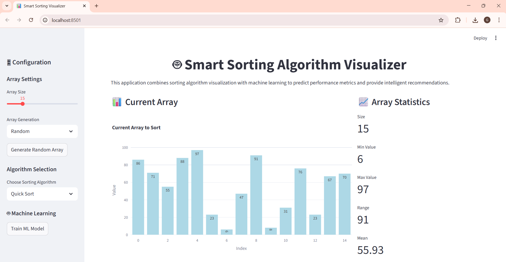

Smart Sorting Visualizer 🤖📊

An interactive web application built with Streamlit, Python, and Plotly to visualize classic sorting algorithms and leverage Machine Learning (Random Forest) for predicting their performance metrics. 

🚀 Features

📊 Algorithm Visualization – Step-by-step animations for Bubble Sort, Selection Sort, Insertion Sort, and Quick Sort.

⏱️ Performance Metrics – Displays execution time, comparisons, swaps, and steps.

🤖 Machine Learning Integration – Predicts algorithm performance using a Random Forest model trained on synthetic data.

🎯 Intelligent Recommendation – Suggests the most efficient algorithm based on array characteristics.

📝 Customizable Input – Generate random, nearly sorted, reverse sorted, or custom arrays.

🎬 Dynamic Visuals – Interactive charts and animations powered by Plotly.

 

🛠️ Tech Stack

Frontend/UI: Streamlit, HTML/CSS (custom styling)

Backend/Logic: Python (sorting algorithms implemented from scratch)

Visualization: Plotly, Matplotlib

Machine Learning: Scikit-learn (Random Forest Regressor)

Data Handling: NumPy, Pandas
 

📷 Screenshots

 

🎯 Future Enhancements

🔹 Add more algorithms (Merge Sort, Heap Sort, Radix Sort).

🔹 Improve ML model with larger datasets.

🔹 Enable export of results/visualizations as reports.
 

🤝 Contributing

Contributions are welcome! Fork the repository and submit a pull request to suggest improvements or new features. 

📜 License

This project is licensed under the MIT Licenses 
